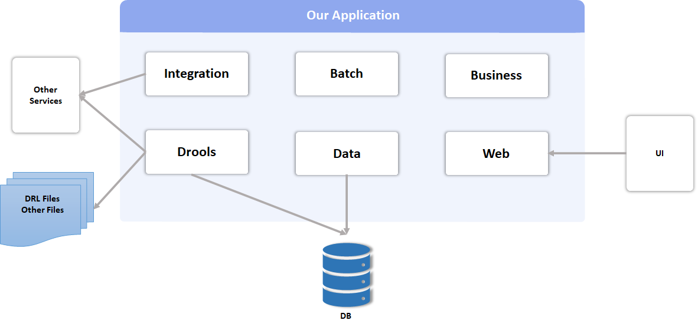
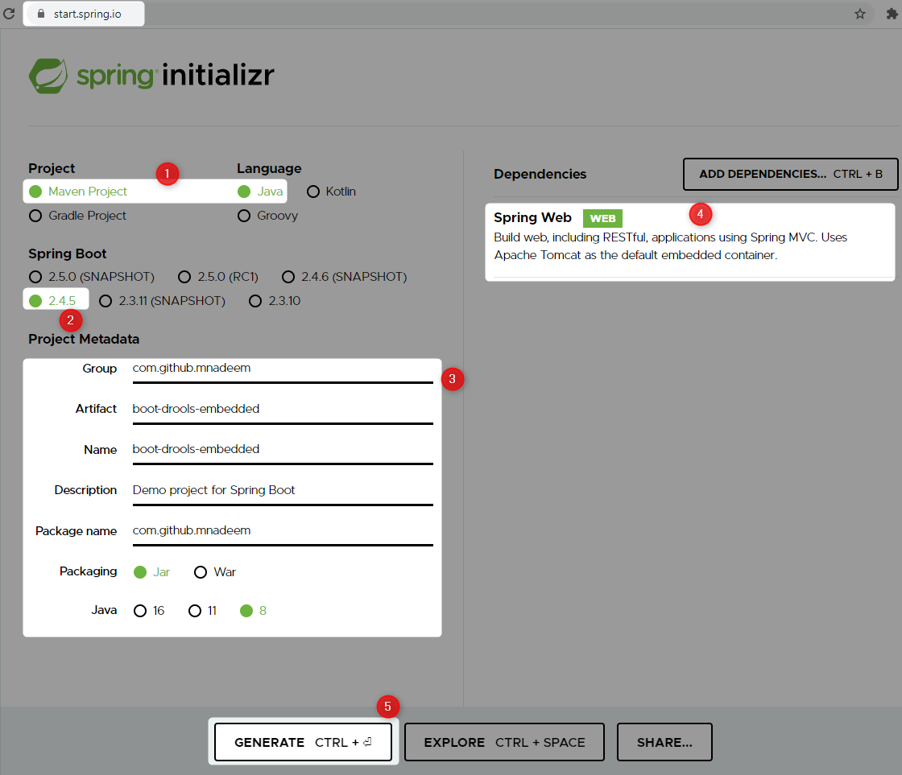
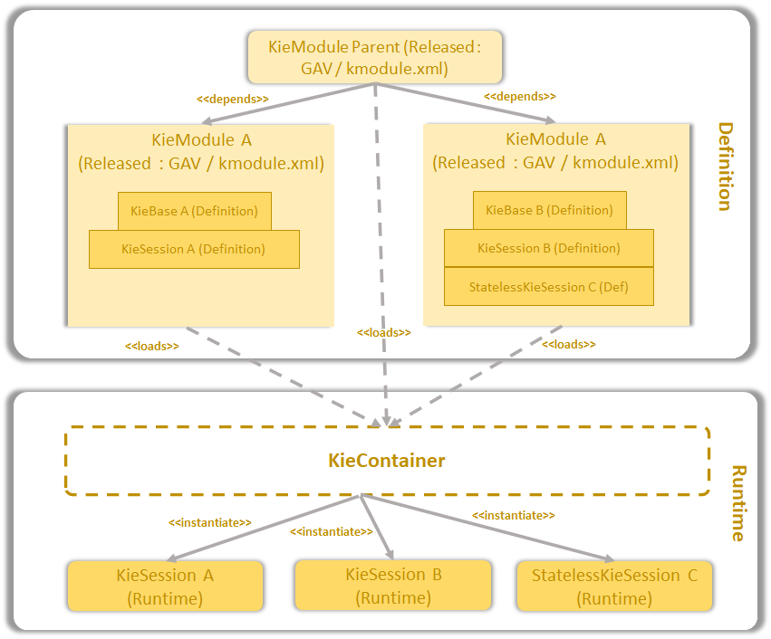

GETTING STARTED WITH DROOLS IN SPRING BOOT PROJECT

Lets embed rule engine execution within spring boot application


Create Spring Boot Project
https://start.spring.io/

Add the following pom dependencies

```
<dependency>
    <groupId>org.drools</groupId>
    <artifactId>drools-core</artifactId>
    <version>${kie.version}</version>
</dependency>
<dependency>
    <groupId>org.kie</groupId>
    <artifactId>kie-spring</artifactId>
    <version>${kie.version}</version>
</dependency>
```

kie.version == 7.53.0.Final

| Dependency                 | Notes                                                                                                                                                                                                                                                                                                                                                                                                                                                                        | 
|----------------------------|------------------------------------------------------------------------------------------------------------------------------------------------------------------------------------------------------------------------------------------------------------------------------------------------------------------------------------------------------------------------------------------------------------------------------------------------------------------------------|
| org.drools:drools-core     | Drools rule engine implementation                                                                                                                                                                                                                                                                                                                                                                                                                                            | 
| org.kie:kie-spring         | Contains, org.kie:kie-api, org.drools:drools-compiler, jbpm and spring related dependencies                                                                                                                                                                                                                                                                                                                                                                                  |
| org.kie:kie-api            | Contains all the public interfaces exposed by the KIE Platform,<br> which is composed by Drools, jBPM, and OptaPlanner                                                                                                                                                                                                                                                                                                                                                       |
| org.drools:drools-compiler | Contains the algorithm to translate the rules written in different resources<br> (text files, spreadsheets, your own types, and so on) to executable rules.<br> This artifact is required only because we are compiling our rules in the project.<br> It is possible to separate the rules compilation from the rules execution to remove this dependency from our project; however, for the sake of simplicity, we are going to compile our <br> rules in the same project. |

KIE Components


Kie = Knowledge is Everything

| Component    | Notes                                                                                                                                                                                                                                                                                                                                                                                                                                                                        | 
|--------------|------------------------------------------------------------------------------------------------------------------------------------------------------------------------------------------------------------------------------------------------------------------------------------------------------------------------------------------------------------------------------------------------------------------------------------------------------------------------------|
| KieServices  | Drools rule engine implementation                                                                                                                                                                                                                                                                                                                                                                                                                                            | 
| KieContainer | Contains, org.kie:kie-api, org.drools:drools-compiler, jbpm and spring related dependencies                                                                                                                                                                                                                                                                                                                                                                                  |
| KieModule    | Contains all the public interfaces exposed by the KIE Platform,<br> which is composed by Drools, jBPM, and OptaPlanner                                                                                                                                                                                                                                                                                                                                                       |
| KieBase      | Contains the algorithm to translate the rules written in different resources<br> (text files, spreadsheets, your own types, and so on) to executable rules.<br> This artifact is required only because we are compiling our rules in the project.<br> It is possible to separate the rules compilation from the rules execution to remove this dependency from our project; however, for the sake of simplicity, we are going to compile our <br> rules in the same project. |
| KieSession   | Contains the algorithm to translate the rules written in different resources<br> (text files, spreadsheets, your own types, and so on) to executable rules.<br> This artifact is required only because we are compiling our rules in the project.<br> It is possible to separate the rules compilation from the rules execution to remove this dependency from our project; however, for the sake of simplicity, we are going to compile our <br> rules in the same project. |
