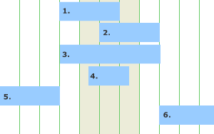

Finding overlapping dates and times in MySQL
May 1, 2008  Flipflops  MySQL, Web Things
Quite often you end up in situations where you are required to check and see if one time period overlaps another time period. Probably the most common situation this occurs in is when you are building a booking system – be it for tables or cars or rooms.

You have a series of entries in a database with a start (date)time and an end (date)time and before adding a new record you need to check that it doesn’t overlap with another booking.

The solution is fairly simple but I always end up making a quick diagram on a piece of paper to check.

Time overlapping diagram

As you can see two time periods can either be sequential (i.e. there is no overlap at all) or they can overlap in one of four ways. Put this into a diagram and the solution becomes pretty obvious.

There is an overlap if end_time_1 > start_time_2 AND start_time_1 < end_time_2

Time	start_1	start_2	end_1	end_2	end_1 > start_2	start_1 < end_2
1	09:00	08:00	11:00	10:00	true	true
2	09:00	10:00	11:00	12:00	true	true
3	09:00	08:00	11:00	12:00	true	true
4	09:00	09:30	11:00	10:30	true	true
5	09:00	07:00	11:00	08:00	false	true
6	09:00	12:00	11:00	13:00	true	false
An example SQL query would be something like the one below but make sure your datetime formats are correct – in MySQL the default format is YYYY-MM-DD hh:mm:ss

SELECT * FROM bookings WHERE room_id = '" . $room_id . "' AND ((date_end > '" . $start_date . "') AND (date_start < '" . $end_date . "')) ";

The above query will pull back the records where the times overlap.